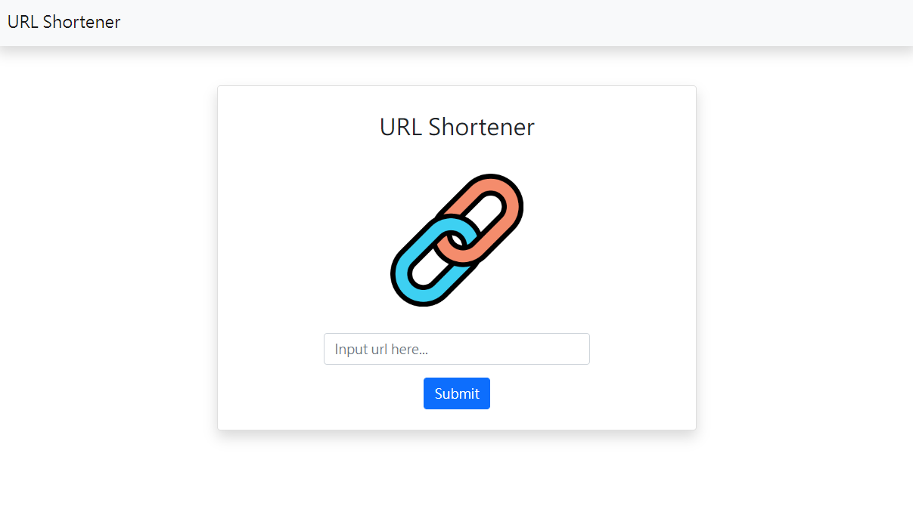

# URL Shortener




## 介紹

 一個簡單的短網址產生器

## 功能

- 將網址轉換成短網址
- 可用短網址導到原網

1. 請先安裝 node.js 與 npm
2. 將專案 clone 到本地
3. 在本地開啟之後，透過終端機進入資料夾，輸入：

   ```bash
   npm install
   ```

4. 安裝完畢後，輸入：

   ```bash
   npm run start
   ```

5. 看見此行訊息代表成功運行，可用瀏覽器進入到以下網址

   ```bash
   Listening on http://localhost:3000
   ```

6. 結束運行輸入

   ```bash
   ctrl + c
   ```

## 開發工具

- Node.js 14.16.0
- Express 4.18.1
- Express-Handlebars 3.0.0
- Bootstrap 5.0.2
- Mongoose 5.9.7
